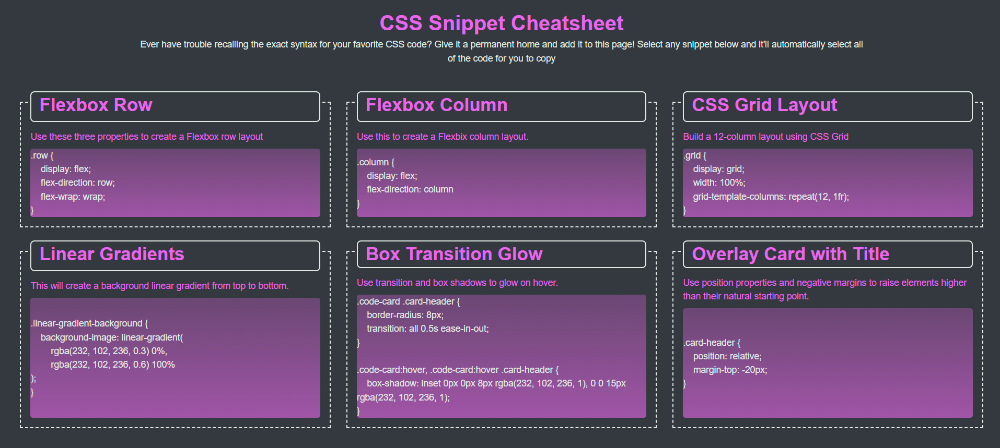
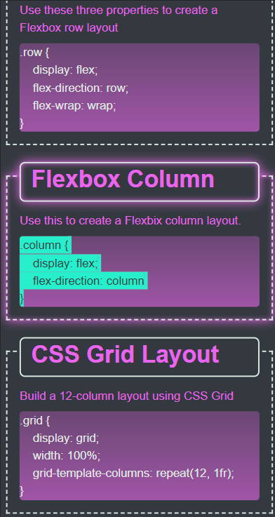

# CSS Cheatsheet
(You can access our deployed website here: https://honguyen00.github.io/code-snippet/)

## Description

The aim of this project is to have a website that can contain multiple snippets of css code that I think is important or might be used alot.

By having them all central in this website, I am able to copy the needed css code immediately without having to look for them online.

## Installation

N/A

## Usage
This is the overall look of the website  

When you want to copy a snippet of css code, click on the card that contain the piece of code. The card will be hightlighted as well as the block of code will be selected. Then you can right click -> copy (CTRL + C) and paste the code the wherever you want.

  

